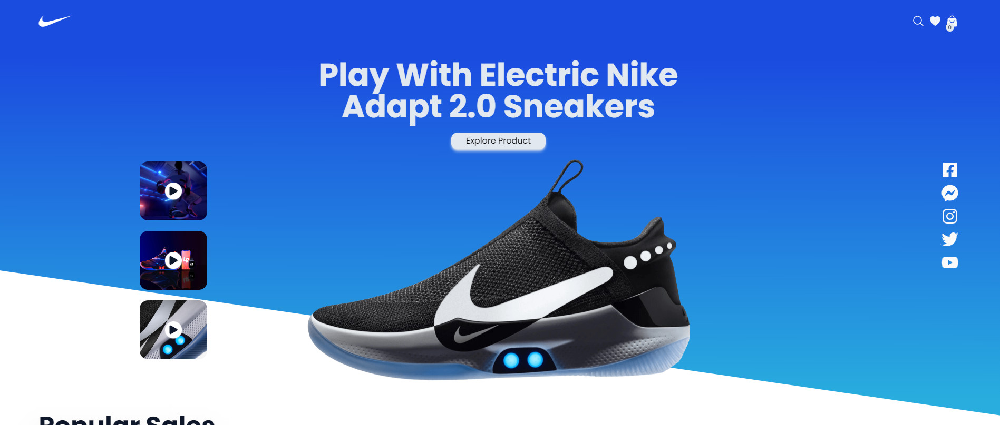
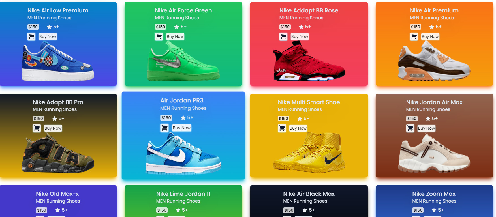
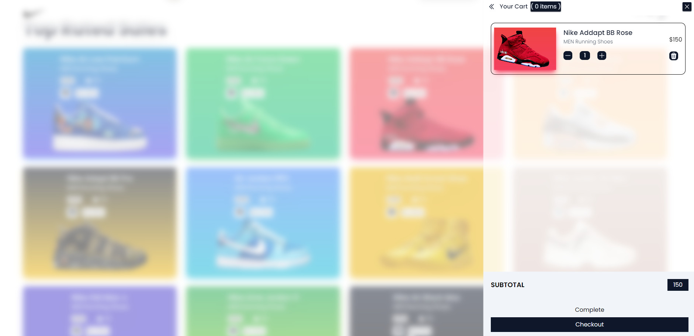

**Cám ơn mọi người đã ghé qua**

## Đây là website bán giày

<hr>

### Công nghệ sử dung

-  **_ReduxToolkit_**

<hr>

### Để sử dụng project thì

-  Clone project bằng lệnh sao

```shell
   git clone https://github.com/Tran-Duoc/Nike_App.git
```

-  Sao khi clone xong

```shell
   cd src
   npm install
   npm run dev
```

<hr>

> Đây là project áp dụng kiến thức reduxToolKit mà mình học.

Đây là kênh youtube mà mình clone ý tưởng của họ. Mọi người có thể xem ở đây _[JSStack](https://www.youtube.com/watch?v=QnykUEqAVoc&t=10671s)_

<hr>

**Đây là 1 số hình ảnh về web**



<br>



<br>


